<div align="center">



<p>
  <a href="https://abhradeepd.github.io"></a>
  <a href="https://www.linkedin.com/in/abhradeep-das-ds09ji3/"></a>
  <a href="mailto:abhradeep.das@gwu.edu"></a>
  <a href="https://abhradeepd.github.io/assets/Abhradeep_Das_AE.pdf"></a>
</p>

</div>

---

### <samp>// 01 · hello</samp>

Hey, I'm Abhradeep — thanks for stopping by 

I'm an **Analytics Engineer** with an MS in Data Science from The George Washington University. My favourite kind of problem is the messy one: five systems disagreeing about the same number, and nobody sure which to trust. I like turning that into one tested, documented model everyone can point at — and then handing people a dashboard they can actually answer their own questions with.

```sql
select
    name,
    role,
    stack,
    open_to,
    location
from  engineers
where name = 'Abhradeep Das';

-- 1 row returned -------------------------------------------------------------
-- name      | Abhradeep Das
-- role      | Analytics Engineer
-- stack     | {dbt, sql, snowflake, bigquery, power bi, python}
-- open_to   | {full-time roles, open-source collaboration}
-- location  | anywhere in India · open to relocating
```

- 👯 **Open to collaborating on open-source data engineering projects** — pipelines, dbt packages, tooling, docs. Send an issue or a message.
- 🇮🇳 **Open to work anywhere in India**, and to relocating internationally with visa sponsorship.
- 💬 Ask me anything about **dbt, dimensional modelling, SQL or BI** — genuinely, I enjoy these conversations.
- 📫 Reach me at **abhradeep.das@gwu.edu**

> 🔍 **Currently seeking:** full-time **Analytics Engineer**, **BI Engineer**, or **Data Analyst** roles.

<details>
<summary><samp>&nbsp;🍥&nbsp; a few things that aren't on my résumé</samp></summary>

<br>

- My portfolio site is hand-built — no framework, no build step — and its colour palette is quietly borrowed from **Obito Uchiha**. If you spotted that, we'll get along.
- I'd rather ship a small model with tests than a large one without.
- The fastest way to my heart is a well-named column.

</details>

---

### <samp>// 02 · what i build</samp>

```text
  raw sources  ──▶   ingest   ──▶     warehouse      ──▶  model + test ✓ ──▶    serve
 CSV·API·events    dlt·Airflow   Snowflake·BigQuery·DuckDB    dbt·tests·docs   Power BI·Tableau
```

---

### <samp>// 03 · how i work</samp>

```yaml
# principles.yml
- one_definition_per_metric:  agreed with stakeholders before it ships
- tests_are_not_optional:     not_null, unique, relationships, freshness
- documented_or_it_doesn't_exist: every model, every column
- readable_beats_clever:      the next person is usually me
- start_from_the_question:    dashboards are answers, not tables on a page
```

---

### <samp>// 04 · toolbox</samp>

**Transformation & modeling**

<p>
  
  
  
  
  
  
</p>

**Languages & databases**

<p>
  
  
  
  
  
  
  
</p>

**Orchestration & DevOps**

<p>
  
  
  
  
  
  
  
  
</p>

**Warehouses & cloud**

<p>
  
  
  
  
  
</p>

**BI & reporting**

<p>
  
  
  
  
</p>

**Analytics & ML**

<p>
  
  
  
  
  
  
  
  
  
  
</p>

---

### <samp>// 05 · numbers</samp>

<div align="center">


</div>

---

<div align="center">

<sub><samp>Thanks for reading — if any of this is useful to you, my inbox is open.</samp></sub>

<sub><samp>// those who abandon their metrics are worse than scum.</samp></sub>

</div>
